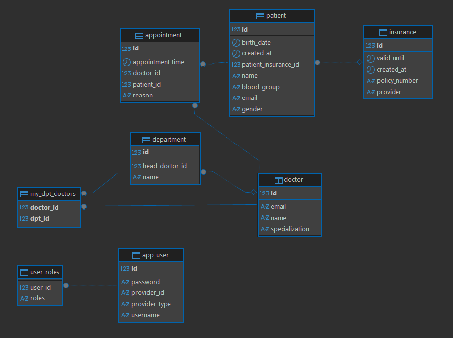

# Hospital Management Backend API

A Spring Boot application for managing hospital operations including patient management, doctor appointments, and administrative functions.

## Database Schema



---

## Prerequisites

### Option 1: Docker (Recommended)
- Docker Desktop or Docker Engine
- Docker Compose

### Option 2: Local Development
- Java 17 or higher
- Maven 3.6+
- PostgreSQL database

## Running the Application

### Docker (Recommended)

**First Time Setup:**

1. **Navigate to project root**
   ```bash
   cd path/to/hospitalManagement
   ```

2. **Create environment file**
   ```bash
   cp .env-example .env
   ```

3. **Edit `.env` file and set your values** (especially `JWT_SECRET_KEY`)

**Start Application:**

```bash
# Build and start all services (app + database)
docker-compose up -d --build

# View logs
docker-compose logs -f

# View only app logs
docker-compose logs -f app
```

**Application will be available at:** `http://localhost:8080`

**Stop Application:**

```bash
# Stop services
docker-compose down

# Stop and remove all data (deletes database)
docker-compose down -v
```

**Rebuild after code changes:**

```bash
docker-compose up -d --build
```

**Access Database:**

```bash
# Connect to PostgreSQL container
docker exec -it hospital-postgres psql -U postgres -d postgres

# List tables
\dt

# Exit
\q
```

---

### Local Development (Without Docker)

**Prerequisites:**
- Install Java 17, Maven, and PostgreSQL locally

**Setup:**

1. **Create PostgreSQL database**
   ```sql
   CREATE DATABASE postgres;
   ```

2. **Update `application.yml`** with your database credentials

3. **Create `.env` file**
   ```bash
   cp .env-example .env
   ```

**Run:**

```bash
# Navigate to project root
cd path/to/hospitalManagement

# Clean and build
mvn clean install

# Run application
mvn spring-boot:run
```

The server will start on `http://localhost:8080`

## API Documentation

### Authentication Endpoints

#### Signup
Creates a new user account with specified roles.

**Request:**
```bash
curl -X POST http://localhost:8080/auth/signup \
  -H "Content-Type: application/json" \
  -d '{
    "username": "john_doe",
    "password": "securePassword123",
    "name": "John Doe",
    "roles": ["PATIENT"]
  }'
```

**Response:**
```json
{
  "id": 1,
  "username": "john_doe"
}
```

**Available Roles:** `ADMIN`, `DOCTOR`, `PATIENT`

#### Login
Authenticates a user and returns a JWT token.

**Request:**
```bash
curl -X POST http://localhost:8080/auth/login \
  -H "Content-Type: application/json" \
  -d '{
    "username": "john_doe",
    "password": "securePassword123"
  }'
```

**Response:**
```json
{
  "jwt": "eyJhbGciOiJIUzI1NiIsInR5cCI6IkpXVCJ9...",
  "userId": 1
}
```

---

### Public Endpoints

#### Get All Doctors
Retrieves a list of all registered doctors (no authentication required).

**Request:**
```bash
curl http://localhost:8080/public/doctors
```

**Response:**
```json
[
  {
    "id": 1,
    "name": "Dr. Sarah Johnson",
    "specialization": "Cardiology",
    "email": "sarah.johnson@hospital.com"
  },
  {
    "id": 2,
    "name": "Dr. Michael Chen",
    "specialization": "Neurology",
    "email": "michael.chen@hospital.com"
  }
]
```

---

### Admin Endpoints
**Required Role:** `ADMIN`

#### Get All Patients
Retrieves a paginated list of all patients.

**Request:**
```bash
curl "http://localhost:8080/admin/patients?page=0&size=10" \
  -H "Authorization: Bearer YOUR_JWT_TOKEN"
```

**Query Parameters:**
- `page` (optional, default: 0) - Page number
- `size` (optional, default: 10) - Page size

**Response:**
```json
[
  {
    "id": 1,
    "name": "John Doe",
    "gender": "Male",
    "birthDate": "1990-05-15",
    "bloodGroup": "O_POSITIVE"
  },
  {
    "id": 2,
    "name": "Jane Smith",
    "gender": "Female",
    "birthDate": "1985-08-22",
    "bloodGroup": "A_POSITIVE"
  }
]
```

#### Onboard New Doctor
Converts an existing user to a doctor by assigning doctor role and details.

**Request:**
```bash
curl -X POST http://localhost:8080/admin/onBoardNewDoctor \
  -H "Content-Type: application/json" \
  -H "Authorization: Bearer YOUR_JWT_TOKEN" \
  -d '{
    "userId": "5",
    "name": "Dr. Emily Brown",
    "specialization": "Pediatrics"
  }'
```

**Response:**
```json
{
  "id": 5,
  "name": "Dr. Emily Brown",
  "specialization": "Pediatrics",
  "email": "emily.brown@hospital.com"
}
```

---

### Doctor Endpoints
**Required Role:** `DOCTOR` or `ADMIN`

#### Get Doctor's Appointments
Retrieves all appointments for the logged-in doctor.

**Request:**
```bash
curl http://localhost:8080/doctors/appointments \
  -H "Authorization: Bearer YOUR_JWT_TOKEN"
```

**Response:**
```json
[
  {
    "id": 1,
    "appointmentTime": "2026-01-20T10:30:00",
    "reason": "Routine checkup",
    "doctor": {
      "id": 1,
      "name": "Dr. Sarah Johnson",
      "specialization": "Cardiology",
      "email": "sarah.johnson@hospital.com"
    }
  },
  {
    "id": 2,
    "appointmentTime": "2026-01-20T14:00:00",
    "reason": "Follow-up consultation",
    "doctor": {
      "id": 1,
      "name": "Dr. Sarah Johnson",
      "specialization": "Cardiology",
      "email": "sarah.johnson@hospital.com"
    }
  }
]
```

---

### Patient Endpoints
**Required Role:** `PATIENT` (authenticated user)

#### Create Appointment
Books a new appointment with a doctor.

**Request:**
```bash
curl -X POST http://localhost:8080/patients/appointments \
  -H "Content-Type: application/json" \
  -H "Authorization: Bearer YOUR_JWT_TOKEN" \
  -d '{
    "doctorId": 1,
    "patientId": 4,
    "appointmentTime": "2026-01-25T10:30:00",
    "reason": "Routine checkup"
  }'
```

**Response:**
```json
{
  "id": 10,
  "appointmentTime": "2026-01-25T10:30:00",
  "reason": "Routine checkup",
  "doctor": {
    "id": 1,
    "name": "Dr. Sarah Johnson",
    "specialization": "Cardiology",
    "email": "sarah.johnson@hospital.com"
  }
}
```

#### Get Patient Profile
Retrieves the profile information of the logged-in patient.

**Request:**
```bash
curl http://localhost:8080/patients/profile \
  -H "Authorization: Bearer YOUR_JWT_TOKEN"
```

**Response:**
```json
{
  "id": 4,
  "name": "John Doe",
  "gender": "Male",
  "birthDate": "1990-05-15",
  "bloodGroup": "O_POSITIVE"
}
```

---

## Security & Authorization

### Authentication
All protected endpoints require a JWT token in the Authorization header:
```
Authorization: Bearer YOUR_JWT_TOKEN
```

### Role-Based Access Control

| Endpoint | Required Role | Additional Permissions |
|----------|---------------|------------------------|
| `/auth/**` | Public | None |
| `/public/**` | Public | None |
| `/admin/**` | `ADMIN` | DELETE operations require `APPOINTMENT_DELETE` or `USER_MANAGE` |
| `/doctors/**` | `DOCTOR` or `ADMIN` | None |
| `/patients/**` | Authenticated | None |

### OAuth2 Support
The application supports OAuth2 authentication via:
- Google
- GitHub

Configure the client credentials in your `.env` file to enable OAuth2 login.

---

## Data Models

### Blood Group Types
- `A_POSITIVE`, `A_NEGATIVE`
- `B_POSITIVE`, `B_NEGATIVE`
- `AB_POSITIVE`, `AB_NEGATIVE`
- `O_POSITIVE`, `O_NEGATIVE`

### Role Types
- `ADMIN` - Full system access
- `DOCTOR` - Access to appointments and patient information
- `PATIENT` - Access to own profile and appointment booking

---

## Error Handling

The API returns appropriate HTTP status codes:
- `200 OK` - Successful GET request
- `201 Created` - Successful POST request
- `400 Bad Request` - Invalid request data
- `401 Unauthorized` - Missing or invalid JWT token
- `403 Forbidden` - Insufficient permissions
- `404 Not Found` - Resource not found
- `500 Internal Server Error` - Server error

---

## Development Notes

### Testing with cURL
Replace `YOUR_JWT_TOKEN` with the actual token received from the login endpoint.

### Default Port
The application runs on port `8080` by default. You can change this in `application.yml`.

### Database Initialization
The application uses Hibernate's `ddl-auto: update` strategy, which will automatically create/update tables based on entity definitions.

---

## License

This project is licensed under the MIT License.